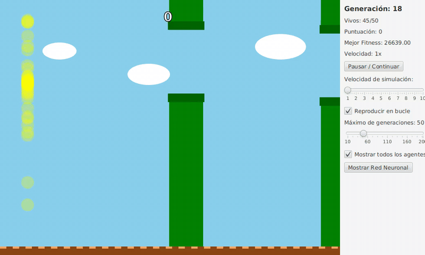
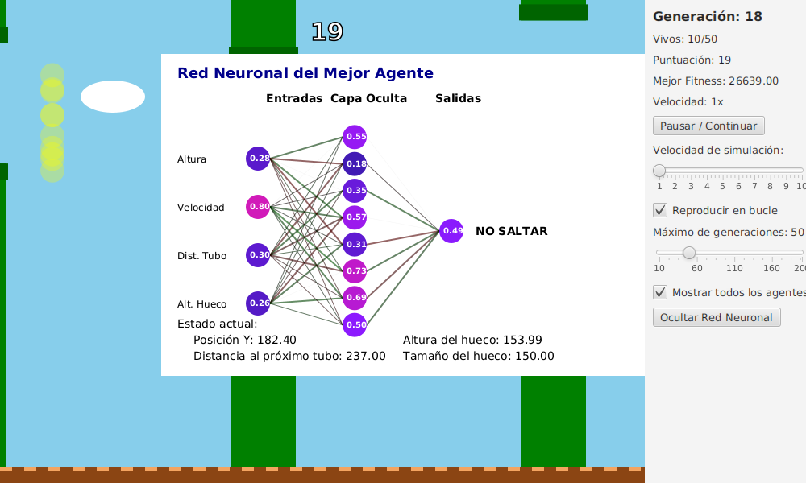
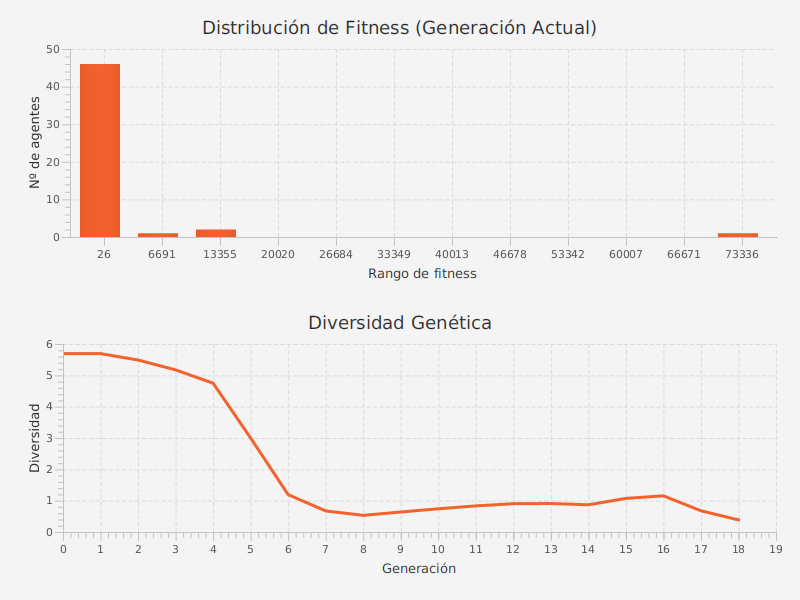
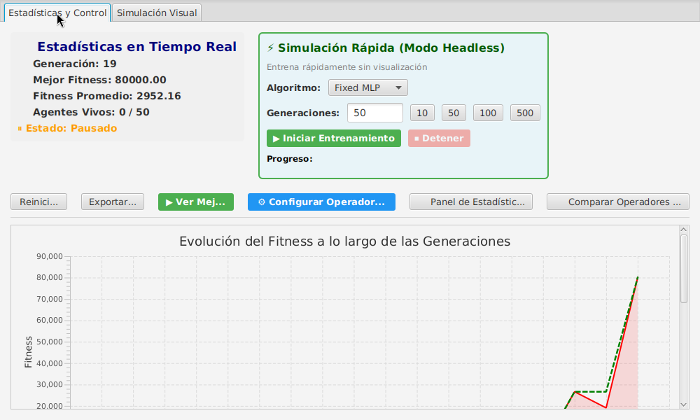
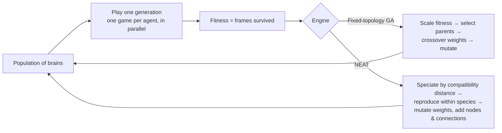
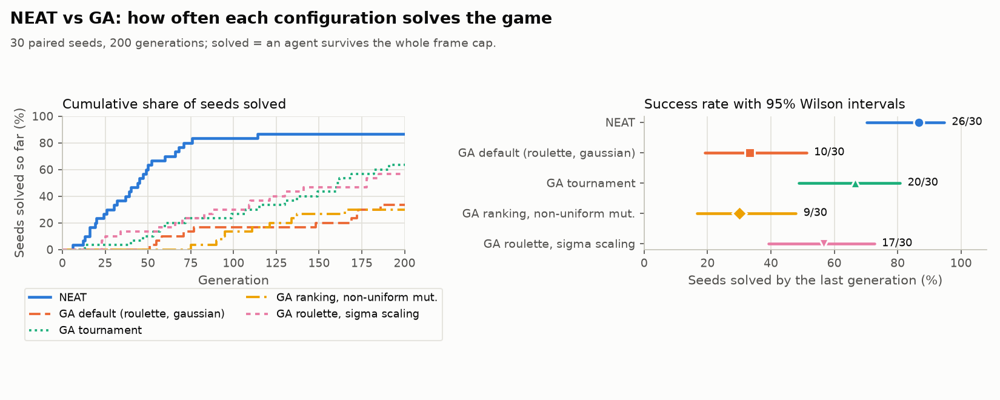
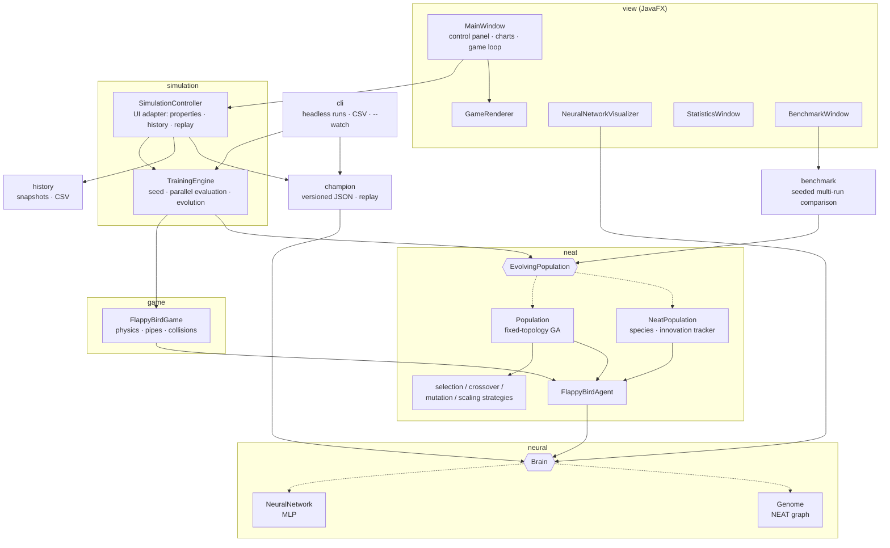

# FlappyBirdNEAT

[](https://github.com/guillesanper/FlappyBirdNeat/actions/workflows/ci.yml)


[](LICENSE)

**A neuroevolution lab built from scratch in Java: 50 birds, each controlled by its own neural network, learn to play Flappy Bird with no training data. All they get is natural selection.**

<p align="center">
  
  <br>
  <em>Generation 18 of a real training run: most of the 50 agents still crash early, but the fittest ones have learned to thread the pipes.</em>
</p>

There are no ML libraries involved. The neural networks, both evolution engines and every genetic operator are written by hand:

- **Two interchangeable evolution engines:** a classic genetic algorithm that evolves the weights of a fixed-topology network, and a full implementation of **[NEAT](https://nn.cs.utexas.edu/downloads/papers/stanley.ec02.pdf)** (Stanley & Miikkulainen, 2002), which evolves the network's *structure* as well, with innovation numbers, speciation and historical-marking crossover.
- **16 pluggable genetic operators** (7 selection, 3 crossover, 3 mutation and 3 fitness-scaling, on top of NEAT's own) behind the Strategy pattern. You can mix and match them from the UI at runtime.
- **A live view inside the agent's head:** a network visualizer that shows every activation and the jump decision frame by frame.
- **Portable champions:** trained agents are saved as versioned JSON (a NEAT genome or the MLP's weights, plus the seed, generation and commit that produced them), replayed from the command line or the UI, and shipped with the app: double-click the installer's app and a trained NEAT agent is already playing.
- **Experiment tooling:** a headless command line that trains without opening a window and writes one CSV row per generation, generation history and replay in the UI, and a benchmark mode that compares operator configurations across repeated seeded runs.
- **Parallel and still deterministic:** each agent plays its own copy of the game over the same pipes, so a generation is evaluated across all CPU cores, and the result is bit-for-bit the same with 1 or 8 threads.
- **Seeded and tested:** every run is determined by a single global seed, so the same seed gives the same fitness curve every time. That property is covered by end-to-end tests, along with the operators, the NEAT genome, the simulation loop and the CLI (309 JUnit tests with JaCoCo coverage, run in CI on Linux, Windows and macOS on every push).

## Download

Get the installer for your system from the **[latest release](https://github.com/guillesanper/FlappyBirdNeat/releases/latest)**. It bundles its own Java runtime, so nothing else needs to be installed, and it opens straight on the bundled NEAT champion playing, with its network visualizer; from there you can train your own population.

| System | File | Requirements |
|---|---|---|
| Windows | `FlappyBirdNEAT-<version>.msi` | Windows 10 or 11, x64 |
| macOS | `FlappyBirdNEAT-<version>-macos-arm64.dmg` | macOS on Apple silicon (M1 or later); on Intel Macs use the jar |
| Linux (Debian/Ubuntu) | `flappybirdneat_<version>_amd64.deb` | x86-64, Ubuntu 24.04+ or Debian 13+ (`sudo apt install ./flappybirdneat_*.deb`); installs to `/opt/flappybirdneat` |
| Any (with Java) | `FlappyBirdNEAT-<version>-<platform>.jar` | JDK 21+; pick the jar of your OS (it carries that platform's JavaFX) and run `java -jar` on it |

> [!NOTE]
> The installers are **not code-signed**, so the first launch shows a warning:
> - **Windows SmartScreen** ("Windows protected your PC"): click **More info**, then **Run anyway**.
> - **macOS Gatekeeper** ("cannot be opened because the developer cannot be verified" or "is damaged"): open **System Settings → Privacy & Security** and click **Open Anyway** after the first attempt, or run `xattr -dr com.apple.quarantine /Applications/FlappyBirdNEAT.app`.

The installed launcher also takes the command-line options below (for example `/opt/flappybirdneat/bin/FlappyBirdNEAT --headless ...` on Linux); without options it opens on the champion.

## Screenshots

| Live network visualizer | Evolution statistics |
|---|---|
|  |  |
| Inputs on the left, hidden activations in the middle, and the jump/no-jump output on the right, all updating every frame. | Fitness distribution of the current generation and how genetic diversity collapses as the population converges. |


*Control panel: pick the engine, train headless for N generations and track best/average fitness. This run reached the 80,000 fitness stopping threshold at generation 19.*

## How it works

Each bird is an agent with a `Brain`. Every frame, the brain receives four normalized inputs and decides whether to flap:

| Input | Meaning |
|---|---|
| `y` | Bird height |
| `velocity` | Vertical speed |
| `distance` | Horizontal distance to the next pipe |
| `gapY` | Height of the next pipe's gap |

An output above 0.5 means *jump*. Fitness is the number of frames the bird survives. Birds never interact, so every bird of a generation plays its own copy of the game over the same pipe sequence, in parallel. When every bird has crashed (or a bird reaches the frame cap), the population evolves:



**Fixed-topology GA.** Every brain is a 4 → 8 → 1 multilayer perceptron with sigmoid activations, and only its weights and biases evolve. Every operator can be swapped independently:

| Stage | Implementations |
|---|---|
| Selection | Roulette wheel, ranking, deterministic tournament, probabilistic tournament, truncation, remainder stochastic, stochastic universal sampling |
| Crossover | Uniform, single-point, arithmetic |
| Mutation | Gaussian, uniform, non-uniform (the magnitude decays over generations) |
| Fitness scaling | Linear, sigma, Boltzmann |

**NEAT.** Every brain is a `Genome` of node and connection genes. It starts minimal (inputs wired straight to the output) and grows hidden nodes and connections through structural mutation. A shared `InnovationTracker` gives the same structural change the same innovation number in every genome. Crossover uses those numbers to line up matching, disjoint and excess genes, and speciation uses them to compute compatibility distance, which protects new topologies while they optimize. Evaluating a genome means walking its graph in topological order, so arbitrary (acyclic) topologies just work.

## Results

Does evolving the structure pay off? A paired study ran NEAT and four GA configurations on the same 30 seeds (200 generations, population 50, 20,000-frame cap), with every run reproducible from its seed:

<picture>
  <source media="(prefers-color-scheme: dark)" srcset="docs/results/success_rate-dark.png">
  
</picture>

- **NEAT solved 26/30 seeds** (87%, 95% CI 70-95%), against 20/30 (67%, 49-81%) for the GA with tournament selection and 10/30 (33%, 19-51%) for the GA defaults.
- **NEAT solves sooner**: a median of 44 generations against 160 for the tournament GA (Mann-Whitney, Holm-adjusted p <0.001, Cliff's δ -0.63). In success rate, though, the tournament GA is not significantly worse than NEAT (McNemar, adjusted p 0.109).
- **The study found a bug in NEAT**: species collapsed into one and stopped protecting new topologies. With a dynamic compatibility threshold and stagnation culling, NEAT went from 19/30 to 26/30 seeds solved. (It also found that two GA selection operators never picked the worst agents as parents; that is fixed too.)

The full report, with the methodology, every test, a frame-cap sensitivity study and the threats to validity, is in [docs/results/REPORT.md](docs/results/REPORT.md).

## Architecture



A few design decisions behind it:

- **The engine is abstracted away from the game.** `FlappyBirdGame` and `FlappyBirdAgent` only know about the `Brain` interface (`double[] feedForward(double[])`), and the simulation only knows about `EvolvingPopulation`. Switching between the GA and NEAT is a dropdown in the UI, not a code change.
- **Operators are strategies built by factories** (`SelectionFactory`, `CrossoverFactory`, `MutationFactory`, `ScalingFactory`). Adding a new selection method means writing one class; `Population` doesn't change.
- **The training core knows nothing about JavaFX.** `TrainingEngine` owns the seed, the population and the game; `SimulationController` is a thin adapter that turns it into observable properties, chart series and history snapshots for the UI, and the CLI drives the engine directly. `Main` chooses between the CLI and the UI before any JavaFX class is touched, and a test runs the CLI in an isolated class loader to prove that no `javafx.*` class is ever requested.
- **Every run is reproducible from one seed.** `TrainingEngine` and `BenchmarkRunner` own a global seed, and there is no `new Random()` anywhere else: the populations and the networks receive the generator, and operator strategies get it as a call argument instead of storing it, so one strategy instance can be shared without coupling runs. The pipes of generation *g* come from a seed derived from the global seed and *g* (a SplitMix64-style mix), not from the evolution generator, so every agent can replay exactly the same pipes, and the GA and NEAT face the same course for the same seed. Replays draw from derived generators, so opening one never perturbs training. The app logs its seed at startup (`-Dseed=N` to reproduce it), and end-to-end tests check identical curves for the same seed, including pinned values for seed 42.
- **Parallelism without nondeterminism.** A generation's agents are spread over a `ForkJoinPool` (platform threads: the work is CPU-bound, which is not what virtual threads are for). Each agent, its brain (including the activations the visualizer reads) and its game belong to exactly one task; statistics, selection and reproduction then run sequentially in agent order. Tests check that 1, 2, 4 and 8 threads give identical results for both engines, that no two agents ever share a brain, and that stepping every bird through the shared on-screen game frame by frame gives the same generation as the parallel batch.

## Getting started

Requirements: **JDK 21+**. Maven is optional, because the wrapper is included.

```bash
# Run from source
./mvnw javafx:run

# Or build a self-contained jar and run it
./mvnw clean package
java -jar target/FlappyBirdNEAT.jar

# Run the test suite
./mvnw test

# Reproduce a run: the app logs its seed at startup
java -Dseed=42 -jar target/FlappyBirdNEAT.jar
```

### Command-line training

With arguments, the same jar trains headless, without loading JavaFX at all:

```bash
java -jar target/FlappyBirdNEAT.jar --headless --engine neat --seed 42 \
    --generations 200 --population 50 --out results.csv
```

| Option | Default | Meaning |
|---|---|---|
| `--headless` | | Required to train from the command line (no arguments opens the UI) |
| `--out FILE` | | CSV to write (required) |
| `--engine neat\|ga` | `neat` | Evolution engine |
| `--seed N` | random | Global seed; printed in the summary so any run can be repeated |
| `--generations N` | 100 | Generations to run |
| `--population N` | 50 | Agents per generation |
| `--max-frames N` | 20000 | Frame cap per generation; an agent that reaches it *solves* the game |
| `--threads N` | all cores | Threads that evaluate a generation's agents (results don't depend on it) |
| `--stop-on-solve` | off | Stop after the first solved generation |
| `--selection`, `--crossover`, `--mutation`, `--scaling` | roulette, uniform, gaussian, none | GA operators (GA only), e.g. `--selection deterministic_tournament --mutation non_uniform --scaling sigma` |
| `--save-champion FILE` | off | Also save the run's best agent as a champion file (see [Champions](#champions)) |

`--help` lists every operator key. Invalid arguments print a message and exit with status 2; I/O errors and unreadable champion files exit with 1.

The CSV has one row per generation, written as soon as the generation ends:

```csv
generation,best,mean,min,species,diversity,frames,wall_ms,nodes,connections,solved
1,240,43.1000,26,1,0.2430,240,65,6.0000,5.0000,false
2,485,81.0800,26,1,0.2408,485,54,6.0200,5.0200,false
3,245,64.3600,26,1,0.5502,245,29,6.0600,5.0600,false
```

`best`, `mean` and `min` are fitness (frames survived), `frames` is how long the generation lasted, `diversity` is the mean pairwise genetic distance, and `nodes`/`connections` are the mean node genes and enabled connection genes per NEAT genome. `species`, `nodes` and `connections` are empty for the GA. Rerunning with the same seed reproduces the file exactly, except for `wall_ms`. A summary follows on stdout:

```
Training summary
  Engine:        NEAT
  Seed:          42
  Generations:   200 of 200 (population 50, max 20000 frames per generation, 4 threads)
  Best fitness:  16199 (generation 196)
  Solved:        no (no agent reached 20000 frames)
  Total time:    3.0 s
  CSV:           results.csv
```

Progress is logged to stderr every 10 generations.

### Champions

A champion is a trained agent saved as versioned JSON: the NEAT genome (nodes, and connections with their innovation numbers, weights and enabled flags) or the MLP's weights and biases, plus where it came from. Weights keep every digit, so a champion read back makes exactly the same decisions.

```bash
# Train and keep the best agent (the first one to reach the run's best fitness)
java -jar target/FlappyBirdNEAT.jar --headless --engine neat --seed 3 --generations 200 \
    --stop-on-solve --out run.csv --save-champion champ.json

# Watch it play alone, in a loop, with its network visualizer open
java -jar target/FlappyBirdNEAT.jar --watch champ.json

# Watch the NEAT champion bundled with the app
java -jar target/FlappyBirdNEAT.jar --demo
```

```json
{
  "format": "flappy-neat-brain",
  "version": 1,
  "engine": "neat",
  "metadata": { "seed": 3, "generation": 39, "fitness": 20000.0, "commit": "40b9c9c", "appVersion": "2.0.0",
                "training": { "population": 50, "maxFrames": 20000, "...": "..." } },
  "network": { "inputs": 4, "outputs": 1, "biasNode": 4, "nodes": [ ... ], "connections": [ ... ] }
}
```

`--watch` checks the file before opening any window: another format, an unknown `version` or `engine` (`neat` or `mlp`) or an inconsistent network (a cycle, a connection to a missing node, the wrong number of inputs) is reported with a clear message and exit status 1. In the UI, the **Campeón** row does the same with **Ver campeón** (the bundled one), **Cargar campeón** (any file) and **Exportar campeón** (the best agent of your training).

[`champions/`](champions/README.md) holds a NEAT and a GA champion trained with documented seeds; both reach the 20,000-frame cap. Replaying champions on pipe sequences they never trained on hints at a difference between the engines. In a small check (the champions of NEAT seeds 2 and 3 and of GA tournament seeds 1 to 5, each on 100 new sequences), the NEAT champions survived 94 and 100 of them, the GA ones 0, 19, 20, 51 and 100: GA champions tend to overfit to the pipes of the generation that produced them. Seven champions are an anecdote, not a study, but it is why the bundled ones were picked among those that survived every sequence.

### Development

- `./mvnw verify` runs the tests, writes the JaCoCo report to `target/site/jacoco/` and fails if engine line coverage drops below 75%. The JavaFX view layer is excluded from coverage; it is checked by running the app.
- Code is formatted with [palantir-java-format](https://github.com/palantir/palantir-java-format) through Spotless. Run `./mvnw spotless:apply` before committing; CI runs `spotless:check`. The bulk reformat is listed in `.git-blame-ignore-revs` (`git config blame.ignoreRevsFile .git-blame-ignore-revs`).
- Logging goes through SLF4J (slf4j-simple). Use `-Dorg.slf4j.simpleLogger.defaultLogLevel=debug` for more detail.
- CI also builds the jar and runs two short headless trainings as a smoke test, checking the CSV and that no JavaFX class gets loaded, and saves a champion and checks that `--watch` rejects a file with an unknown version.

### Releases

[`packaging/jpackage.sh`](packaging/jpackage.sh) builds a native installer with `jpackage`: it links a Java runtime with only the modules the app needs and packages it with the app (`packaging/jpackage.sh deb` after `./mvnw package`; `msi` needs WiX Toolset 3, `dmg` a Mac). The [release workflow](.github/workflows/release.yml) runs it on Ubuntu, Windows and macOS: pushing a tag `vX.Y.Z` that matches the pom version publishes the deb, msi, dmg and per-platform jars as a GitHub Release with generated notes, and running the workflow by hand builds them as artifacts without publishing anything.

Quick tour: press **Ver campeón** to watch a trained NEAT agent right away. Then, on the **Estadísticas y Control** tab, choose an engine (`Fixed MLP` or `NEAT`), press **Iniciar Entrenamiento** to train headless, then **Ver Mejor** to watch the best generation play, and open **Mostrar Red Neuronal** to see inside its head. *(The UI is in Spanish.)*

## Performance

Generations per second of a full training run (play every agent, then speciate, select and breed), measured with JMH (`GenerationThroughputBenchmark`: 30 seeded generations per invocation, at most 5,000 frames per generation, 3 warm-up and 5 measured iterations, mean ± 99.9% error):

| Engine | Population | 1 thread | 2 threads | 4 threads | 8 threads | Speed-up at 4 |
|---|---|---|---|---|---|---|
| GA | 50 | 182 ± 62 | 267 ± 45 | 439 ± 90 | 409 ± 77 | 2.4× |
| GA | 500 | 127 ± 4 | 155 ± 21 | 211 ± 20 | 203 ± 33 | 1.7× |
| NEAT | 50 | 155 ± 8 | 254 ± 61 | 404 ± 32 | 350 ± 131 | 2.6× |
| NEAT | 500 | 9.7 ± 1.7 | 18.2 ± 3.9 | 33 ± 2 | 30 ± 2 | 3.4× |

Measured on a cloud VM with only **4 vCPUs** (Intel Xeon @ 2.10 GHz, KVM, one thread per core, 15 GB RAM), OpenJDK 21.0.11 on Linux. With 4 cores, 8 threads can only add overhead, and that is what the last column shows. The numbers come from one run on a shared machine, so the error bars are wide; rerun them on your own hardware with:

```bash
./mvnw -P jmh test-compile exec:exec                                 # full matrix, about 6 minutes
./mvnw -P jmh test-compile exec:exec -Djmh.args="-p engine=NEAT -p threads=1,4"
```

How to read them:

- **NEAT with large populations scales best** (3.4× on 4 cores): evaluating a genome means walking its graph every frame, so playing the agents is most of the work.
- **The GA scales worst at 500 agents** (1.7×): a fixed MLP is cheap to evaluate, so most agents of an early generation are played in microseconds, and the sequential part (selection and breeding, plus statistics) becomes a large share of each generation. Profiling one run shows about 180 ms of play against 60 ms of breeding over 30 generations on one thread; the play shrinks with threads, the breeding does not (Amdahl's law). Splitting the agents into larger chunks per task did not help, so the limit is the sequential part rather than scheduling overhead.
- The UI's fast training uses the same engine, so it gets the same speed-up.

## Project structure

```
src/main/java/com/neat/flappybirdneat
├── game/         Bird physics, pipes, collisions
├── neural/       Brain interface, fixed-topology NeuralNetwork
├── neat/         Agents, EvolvingPopulation, fixed-topology GA (Population)
│   ├── selection/ crossover/ mutation/ scaling/   GA operators (Strategy + Factory)
│   └── genome/   NEAT: Genome, genes, InnovationTracker, Species, NeatCrossover, NeatPopulation
├── simulation/   TrainingEngine (JavaFX-free core: seed, parallel evaluation, evolution)
│                 and SimulationController (its UI adapter: properties, history, replay)
├── cli/          Command line: argument parser, headless training runner, CSV writer, --watch
├── champion/     Portable champions: versioned JSON format, metadata, headless replay
├── benchmark/    Seeded multi-run comparison of operator configurations, CSV export
├── history/      Per-generation snapshots for replay and export
├── config/       Genetic-operator configuration shared with the UI
└── view/         JavaFX windows: GameRenderer, network visualizer, statistics, benchmark, operator config
    └── main/     Main window: control panel, charts, simulation panel, history browser, game loop
src/jmh/java      JMH benchmarks (Maven profile `jmh`, outside the normal build)
champions/        Bundled champions (NEAT and GA) and the commands that trained them
packaging/        jpackage script for the native installers
experiments/      NEAT vs GA study: run_study.sh (runner), analyze.py (statistics and figures)
docs/
├── results/      Study report, raw data, figures and key numbers (REPORT.md)
├── media/        Screenshots and demo GIF
├── dev-notes/    Development notes (Spanish)
└── memoria-programacion-evolutiva.pdf   Original project report (Spanish)
```

## Roadmap

- [x] Split the main window class and unify the two renderers into one shared `GameRenderer`
- [x] Headless CLI (`--engine neat --seed 42 --generations 200`) for scripted experiments
- [x] Parallel, deterministic fitness evaluation (one game per agent on a `ForkJoinPool`), with JMH benchmarks
- [x] Published NEAT-vs-GA results across many seeds, with confidence intervals and significance tests ([report](docs/results/REPORT.md))
- [x] Portable champions: versioned JSON, `--save-champion` / `--watch` / `--demo`, export and load from the UI, bundled NEAT and GA champions
- [x] Native installers (Windows/macOS/Linux) via `jpackage`, published from `v*` tags, opening on the bundled champion
- [ ] Code-signed installers (Windows Authenticode, Apple notarization) and an Intel macOS build
- [ ] Evaluate champions on several pipe sequences during training, so the GA's overfitting shows up in fitness

## License

MIT. See [LICENSE](LICENSE).
