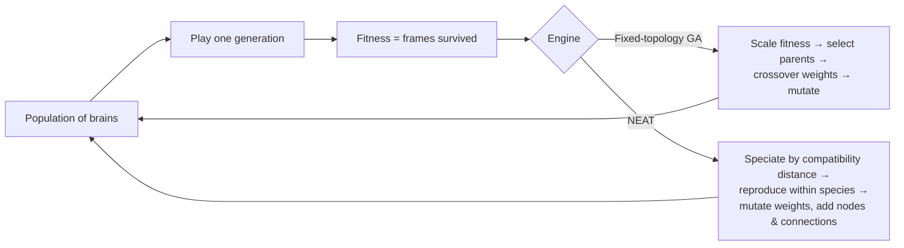
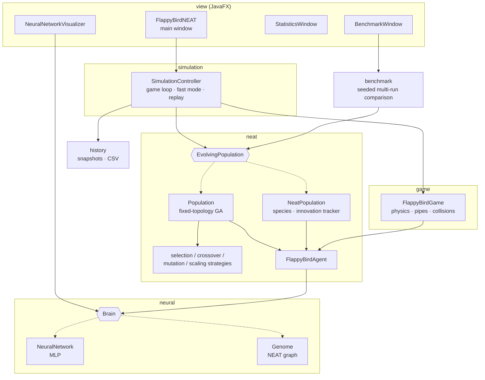

# FlappyBirdNEAT

[](https://github.com/guillesanper/FlappyBirdNeat/actions/workflows/ci.yml)


[](LICENSE)

**A neuroevolution lab built from scratch in Java: 50 birds, each controlled by its own neural network, learn to play Flappy Bird with no training data. All they get is natural selection.**

<p align="center">
  
  <br>
  <em>Generation 18 of a real training run: most of the 50 agents still crash early, but the fittest ones have learned to thread the pipes.</em>
</p>

There are no ML libraries involved. The neural networks, both evolution engines and every genetic operator are written by hand:

- **Two interchangeable evolution engines:** a classic genetic algorithm that evolves the weights of a fixed-topology network, and a full implementation of **[NEAT](https://nn.cs.utexas.edu/downloads/papers/stanley.ec02.pdf)** (Stanley & Miikkulainen, 2002), which evolves the network's *structure* as well, with innovation numbers, speciation and historical-marking crossover.
- **16 pluggable genetic operators** (7 selection, 3 crossover, 3 mutation and 3 fitness-scaling, on top of NEAT's own) behind the Strategy pattern. You can mix and match them from the UI at runtime.
- **A live view inside the agent's head:** a network visualizer that shows every activation and the jump decision frame by frame.
- **Experiment tooling:** a headless fast-training mode, generation history and replay, CSV export, and a benchmark mode that compares operator configurations across repeated seeded runs.
- **Seeded and tested:** the game, the populations and the networks take an injected `Random`, so a seeded run gives the same fitness curve every time. That property is covered by tests, along with the operators, the NEAT genome and the simulation loop (130 JUnit tests, run in CI on every push).

## Screenshots

| Live network visualizer | Evolution statistics |
|---|---|
|  |  |
| Inputs on the left, hidden activations in the middle, and the jump/no-jump output on the right, all updating every frame. | Fitness distribution of the current generation and how genetic diversity collapses as the population converges. |


*Control panel: pick the engine, train headless for N generations and track best/average fitness. This run reached the 80,000 fitness stopping threshold at generation 19.*

## How it works

Each bird is an agent with a `Brain`. Every frame, the brain receives four normalized inputs and decides whether to flap:

| Input | Meaning |
|---|---|
| `y` | Bird height |
| `velocity` | Vertical speed |
| `distance` | Horizontal distance to the next pipe |
| `gapY` | Height of the next pipe's gap |

An output above 0.5 means *jump*. Fitness is the number of frames the bird survives. When every bird has crashed, the population evolves:



**Fixed-topology GA.** Every brain is a 4 → 8 → 1 multilayer perceptron with sigmoid activations, and only its weights and biases evolve. Every operator can be swapped independently:

| Stage | Implementations |
|---|---|
| Selection | Roulette wheel, ranking, deterministic tournament, probabilistic tournament, truncation, remainder stochastic, stochastic universal sampling |
| Crossover | Uniform, single-point, arithmetic |
| Mutation | Gaussian, uniform, non-uniform (the magnitude decays over generations) |
| Fitness scaling | Linear, sigma, Boltzmann |

**NEAT.** Every brain is a `Genome` of node and connection genes. It starts minimal (inputs wired straight to the output) and grows hidden nodes and connections through structural mutation. A shared `InnovationTracker` gives the same structural change the same innovation number in every genome. Crossover uses those numbers to line up matching, disjoint and excess genes, and speciation uses them to compute compatibility distance, which protects new topologies while they optimize. Evaluating a genome means walking its graph in topological order, so arbitrary (acyclic) topologies just work.

## Architecture



A few design decisions behind it:

- **The engine is abstracted away from the game.** `FlappyBirdGame` and `FlappyBirdAgent` only know about the `Brain` interface (`double[] feedForward(double[])`), and the simulation only knows about `EvolvingPopulation`. Switching between the GA and NEAT is a dropdown in the UI, not a code change.
- **Operators are strategies built by factories** (`SeleccionFactory`, `CruceFactory`, `MutacionFactory`, `EscaladoFactory`). Adding a new selection method means writing one class; `Population` doesn't change.
- **Randomness is injected.** The game, the populations and the networks accept a `Random`. That is what lets the benchmark mode compare configurations over the same seeds, and lets tests assert that the same seed gives the same evolution.

## Getting started

Requirements: **JDK 21+**. Maven is optional, because the wrapper is included.

```bash
# Run from source
./mvnw javafx:run

# Or build a self-contained jar and run it
./mvnw clean package
java -jar target/FlappyBirdNEAT-1.0-SNAPSHOT.jar

# Run the test suite
./mvnw test
```

Quick tour: on the **Estadísticas y Control** tab, choose an engine (`Fixed MLP` or `NEAT`), press **Iniciar Entrenamiento** to train headless, then **Ver Mejor** to watch the best generation play, and open **Mostrar Red Neuronal** to see inside its head. *(The UI is in Spanish.)*

## Project structure

```
src/main/java/com/neat/flappybirdneat
├── game/         Bird physics, pipes, collisions
├── neural/       Brain interface, fixed-topology NeuralNetwork
├── neat/         Agents, EvolvingPopulation, fixed-topology GA (Population)
│   ├── selection/ crossover/ mutation/ scaling/   GA operators (Strategy + Factory)
│   └── genome/   NEAT: Genome, genes, InnovationTracker, Species, NeatCrossover, NeatPopulation
├── simulation/   SimulationController: live loop, fast headless training, replay
├── benchmark/    Seeded multi-run comparison of operator configurations, CSV export
├── history/      Per-generation snapshots for replay and export
├── config/       Genetic-operator configuration shared with the UI
└── view/         JavaFX windows: game, network visualizer, statistics, benchmark, operator config
docs/
├── media/        Screenshots and demo GIF
├── dev-notes/    Development notes (Spanish)
└── memoria-programacion-evolutiva.pdf   Original project report (Spanish)
```

## Roadmap

- [ ] Split the main window class and unify the two renderers into one shared `GameRenderer`
- [ ] Headless CLI (`--engine neat --seed 42 --generations 200`) for scripted experiments
- [ ] Parallel fitness evaluation with virtual threads
- [ ] Published NEAT-vs-GA results across many seeds, with confidence intervals and significance tests
- [ ] Native installers (Windows/macOS/Linux) via `jpackage` on every release

## License

MIT. See [LICENSE](LICENSE).
