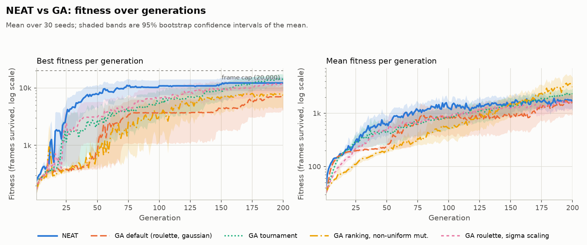
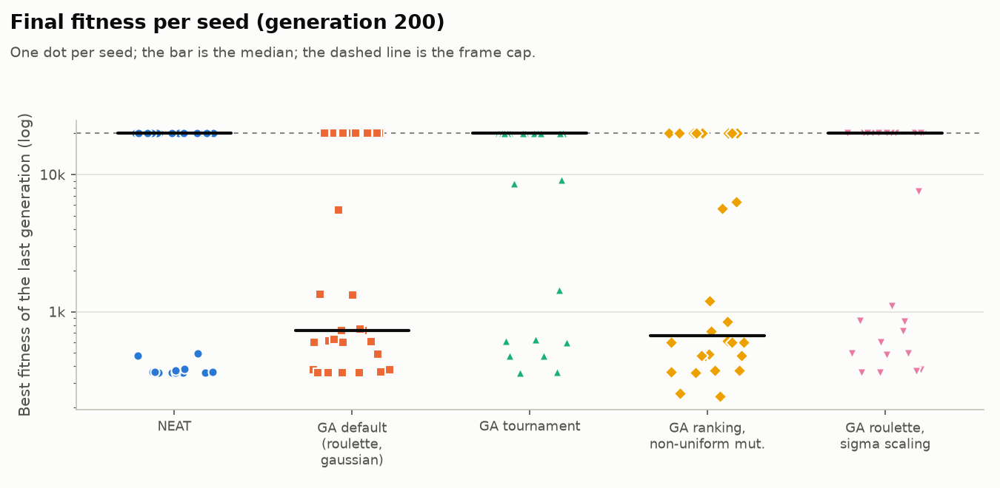
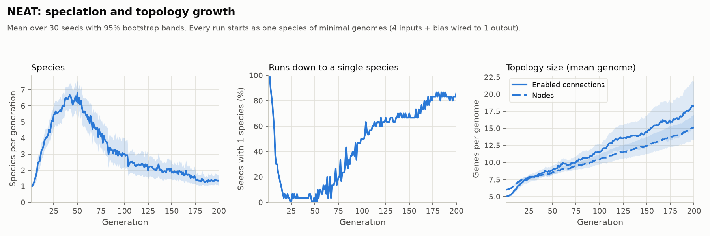
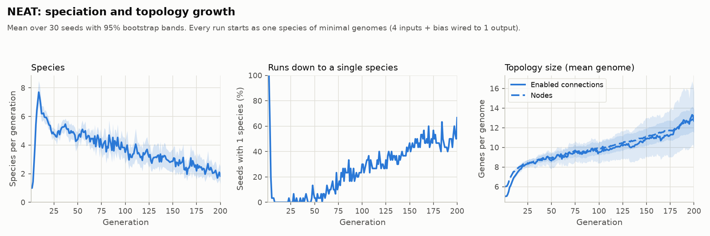

# NEAT vs a fixed-topology GA on Flappy Bird: a 30-seed paired study

Every number in this report is copied from the files written by
[`experiments/analyze.py`](../../experiments/analyze.py): [`stats.json`](stats.json) and
[`summary.md`](summary.md) for the main study, [`sensitivity-5000/`](sensitivity-5000/) for the
frame-cap sensitivity study, and [`pre-fix/`](pre-fix/) and [`pre-ga-fix/`](pre-ga-fix/) for the
runs made before the two bug fixes described below. Section 11 gives the commands to regenerate all
of them.

## 1. Summary

Over 30 paired seeds, NEAT solved the game in 26/30 runs (87%, 95% Wilson CI 70-95%), against
20/30 (67%, 49-81%) for the best GA configuration (deterministic tournament selection) and 10/30
(33%, 19-51%) for the GA defaults (roulette, uniform crossover, Gaussian mutation). NEAT solved
sooner than every GA configuration: a median of 44 generations, against 160 for the tournament GA,
with Holm-adjusted Mann-Whitney p <0.001 and Cliff's δ between -0.59 and -0.81 for all four
contrasts. Its success rate is significantly higher than that of the default GA and the
ranking/non-uniform GA (McNemar, Holm-adjusted p 0.003 and <0.001), but not than that of the
tournament GA (p 0.109) or the sigma-scaling GA (p 0.070). Lowering the frame cap from 20,000 to
5,000 frames leaves those conclusions unchanged. The study also found two bugs, both fixed and
documented here: NEAT species collapsed into one (NEAT solved 19/30 before the fix), and two GA
selection operators never picked the worst 10% of the population as parents.

## 2. Research questions

1. **Does NEAT beat a GA that only evolves the weights of a fixed network in this environment?**
   Measured as how often each method solves the game within 200 generations, and how many
   generations it needs.
2. **Which GA operators matter?** Four GA configurations change one part of the GA defaults at a
   time: the selection method, the mutation operator together with ranking selection, and fitness
   scaling.

## 3. Setup

**Environment and fitness.** Each agent plays its own copy of Flappy Bird. Every frame its network
receives four normalized inputs (bird height, vertical speed, horizontal distance to the next pipe
and height of that pipe's gap), and an output above 0.5 makes it flap. A new pipe appears every 120
frames. Fitness is the number of frames the agent survives, up to a frame cap; the main study uses
the CLI default of 20,000 frames (about 166 pipes). All agents of a generation face the same pipes,
and for a given seed and generation the GA and NEAT face the same pipes too.

**Solved.** A run solves the game in the first generation in which some agent reaches the frame cap.
The generations to solve of a run is that generation; a run that never reaches the cap in 200
generations is unsolved.

**Design.** 30 seeds (1..30) × 5 configurations, 200 generations, population 50, 20,000-frame cap,
4 evaluation threads, every run played to the end (no `--stop-on-solve`). Every configuration uses
the same seeds, so the comparisons are paired. Each run is one invocation of the headless CLI:

```
java -jar target/FlappyBirdNEAT-1.0-SNAPSHOT.jar --headless <config args> --seed <seed> --generations 200 --population 50 --max-frames 20000 --threads 4 --out <csv>
```

| Configuration | CLI arguments |
|---|---|
| `neat` | `--engine neat` |
| `ga-default` | `--engine ga --selection roulette --crossover uniform --mutation gaussian --scaling none` |
| `ga-tournament` | `--engine ga --selection deterministic_tournament --crossover uniform --mutation gaussian --scaling none` |
| `ga-ranking-nonuniform` | `--engine ga --selection ranking --crossover uniform --mutation non_uniform --scaling none` |
| `ga-roulette-sigma` | `--engine ga --selection roulette --crossover uniform --mutation gaussian --scaling sigma` |

**GA parameters** (code defaults, not tuned for this study). Every brain is a 4 → 8 → 1 multilayer
perceptron with sigmoid activations; only its weights and biases evolve. 10% elitism (the 5 best
agents are copied unchanged), then the selection operator picks the 45 remaining parents. Mutation
rate 0.1 per weight. Gaussian mutation: σ 0.1. Non-uniform mutation: initial magnitude 0.2,
decaying as (1 - t/T)^2 with T = 200 generations. Ranking selection: β 1.5. Deterministic tournament:
3 contestants. Sigma scaling: f' = max(0, f - mean + 2σ).

**NEAT parameters** (`NeatConfig`). The last five rows were added by the species-collapse fix
(section 6).

| Parameter | Value |
|---|---|
| Excess / disjoint coefficient (c1, c2) | 1.0 / 1.0 |
| Weight-difference coefficient (c3) | 0.4 |
| Initial compatibility threshold δ | 3.0 |
| Weight mutation rate (per connection) | 0.8 |
| Add-connection / add-node rate (per child) | 0.05 / 0.03 |
| Survival threshold (share of each species that may reproduce) | 0.2 |
| Minimum species size for its champion to be copied unchanged | 5 |
| Target number of species (new) | 5 |
| δ step per generation towards the target (new) | 0.3 |
| Minimum δ (new) | 1.0 |
| Stagnation limit, generations without improvement (new) | 15 |
| Species protected from stagnation (new) | 2 |

**Run environment** (from [`data/manifest.json`](data/manifest.json)): commit `4269278`, clean
working tree; OpenJDK 21.0.11 (build 21.0.11+10-1-24.04.2-Ubuntu); Intel(R) Xeon(R) Processor @
2.10GHz, 4 cores; Linux 6.18.44-fc-v80 x86_64. The 150 runs took 505.1 s in total (from
2026-10-08T13:43:29Z to 2026-10-08T13:51:56Z). Results do not depend on the number of threads: the
CSV of a run is identical with 1 and 4 threads, apart from the `wall_ms` column.

## 4. Metrics and statistics

**Metrics per run.**
- *Final best*: the best fitness of generation 200.
- *Solved*: whether the run reached the frame cap in any generation.
- *Generations to solve*: the first solved generation. Unsolved runs are right-censored at 200: they
  are only known to need more than 200 generations. Every run lasts 200 generations, so all
  censoring happens at the same point and the empirical distribution with unsolved runs set to +∞
  is the Kaplan-Meier estimate; its quartiles are reported as ">200" when they fall among the
  unsolved runs.

**Why success and time to solve are the primary metrics.** The final best is capped at the frame
cap, and NEAT (26/30), the tournament GA (20/30) and the sigma-scaling GA (17/30) end at the cap in
at least half of the seeds. Within those runs the final best cannot tell the configurations apart,
so it loses most of its discriminative power. The success rate and the generations to solve do
not saturate, so they carry the conclusions; the final best is reported as a secondary metric.

**Per configuration.** Success rate with a 95% Wilson interval; median and IQR of the generations to
solve (censored as above); median final best and mean final best with a 95% percentile bootstrap
interval (5,000 resamples, generator seed 20021). The bands of the fitness curves use the same
bootstrap.

**NEAT against each GA configuration** (two-sided):
- Final best: Mann-Whitney U with Cliff's δ as the effect size, and the paired Wilcoxon signed-rank
  test on the shared seeds (pairs with no difference are dropped).
- Success: exact McNemar test on the paired outcomes (only the discordant seeds count).
- Generations to solve: Mann-Whitney U with Cliff's δ, unsolved runs tied just after the last
  generation; and a paired sign test on which method solved first (ties, including seeds that
  neither solved, are dropped).

Cliff's δ is P(NEAT > GA) - P(NEAT < GA). For the final best a positive δ favours NEAT; for the
generations to solve a negative δ favours NEAT (fewer generations). Magnitudes follow Romano et al.
(2006): negligible below 0.147, small below 0.33, medium below 0.474, large above.

**Multiple comparisons.** Each test forms a family of four contrasts (NEAT against each GA), and its
p-values are adjusted with Holm's method within the family. The significance level is α = 0.05 on
the adjusted p-values. The tables give the raw p and, in parentheses, the Holm-adjusted p. The
analysis does not test the GA configurations against each other.

## 5. Results

<picture>
  <source media="(prefers-color-scheme: dark)" srcset="success_rate-dark.png">
  
</picture>

<picture>
  <source media="(prefers-color-scheme: dark)" srcset="fitness_curves-dark.png">
  
</picture>

<picture>
  <source media="(prefers-color-scheme: dark)" srcset="final_fitness-dark.png">
  
</picture>

| Configuration | Solved | Success rate (95% Wilson CI) | Generations to solve: median [IQR] | Final best: median | Final best: mean (95% CI) | At the cap |
|---|---|---|---|---|---|---|
| NEAT | 26/30 | 87% (70-95%) | 44 [24, 68] (4 unsolved) | 20,000 | 17,383 (14,765-19,350) | 26/30 |
| GA default (roulette, gaussian) | 10/30 | 33% (19-51%) | >200 [172, >200] (20 unsolved) | 728 | 7,228 (4,025-10,485) | 10/30 |
| GA tournament | 20/30 | 67% (49-81%) | 160 [99, >200] (10 unsolved) | 20,000 | 13,592 (10,364-16,768) | 20/30 |
| GA ranking, non-uniform mut. | 9/30 | 30% (17-48%) | >200 [137, >200] (21 unsolved) | 482 | 6,256 (3,179-9,564) | 8/30 |
| GA roulette, sigma scaling | 17/30 | 57% (39-73%) | 178 [83, >200] (13 unsolved) | 20,000 | 11,821 (8,565-15,072) | 17/30 |

| NEAT vs | Final best: MWU p (Holm) | Cliff's δ | Wilcoxon p (Holm), non-zero pairs | Success: McNemar p (Holm), only NEAT / only GA | Time to solve: MWU p (Holm), Cliff's δ | Time to solve: sign test p (Holm), NEAT / GA first |
|---|---|---|---|---|---|---|
| GA default (roulette, gaussian) | <0.001 (0.001) | +0.48 (large) | 0.012 (0.036), 23 | <0.001 (0.003), 19 / 3 | <0.001 (<0.001), -0.77 | <0.001 (<0.001), 26 / 3 |
| GA tournament | 0.117 (0.117) | +0.18 (small) | 0.158 (0.266), 12 | 0.109 (0.109), 8 / 2 | <0.001 (<0.001), -0.63 | <0.001 (<0.001), 24 / 4 |
| GA ranking, non-uniform mut. | <0.001 (<0.001) | +0.56 (large) | <0.001 (0.002), 23 | <0.001 (<0.001), 18 / 1 | <0.001 (<0.001), -0.81 | <0.001 (<0.001), 26 / 1 |
| GA roulette, sigma scaling | 0.032 (0.063) | +0.26 (small) | 0.133 (0.266), 16 | 0.035 (0.070), 12 / 3 | <0.001 (<0.001), -0.59 | 0.008 (0.008), 22 / 7 |

**Time to solve (primary).** NEAT needs fewer generations than every GA configuration. Against the
default GA: Holm-adjusted MWU p <0.001, δ -0.77; NEAT solved first on 26 seeds and the GA on 3
(sign test p <0.001). Against the tournament GA: p <0.001, δ -0.63, NEAT first on 24 seeds and the
GA on 4 (sign test p <0.001). Against the ranking/non-uniform GA: p <0.001, δ -0.81, 26 / 1 (sign
test p <0.001). Against the sigma-scaling GA: p <0.001, δ -0.59, 22 / 7 (sign test p 0.008). All
four effects are large.

**Success (primary).** NEAT solves significantly more seeds than the default GA (McNemar adjusted p
0.003; 19 seeds solved only by NEAT, 3 only by the GA) and than the ranking/non-uniform GA (p
<0.001; 18 / 1). The differences against the tournament GA (p 0.109; 8 / 2) and the sigma-scaling
GA (p 0.070; 12 / 3) are not significant after the Holm correction.

**Final best (secondary).** NEAT ends higher than the default GA (MWU adjusted p 0.001, δ +0.48,
large; Wilcoxon adjusted p 0.036) and the ranking/non-uniform GA (p <0.001, δ +0.56, large;
Wilcoxon adjusted p 0.002). Against the tournament GA (p 0.117, δ +0.18) and the sigma-scaling GA
(p 0.063, δ +0.26) the difference is not significant, as expected from the saturation at the cap.

## 6. A bug the study found: NEAT species collapse

**Symptom.** The first run of the study ([`pre-fix/`](pre-fix/), commit `fad331b`) showed that
speciation was not protecting new topologies. NEAT solved only 19/30 seeds (median 64 generations
to solve), 26/30 runs ended with a single species, 20/30 had a single species in each of their last
50 generations, and all 11 unsolved runs were among them (11 of 11).

<picture>
  <source media="(prefers-color-scheme: dark)" srcset="pre-fix/neat_dynamics-dark.png">
  
</picture>

**Cause.** Two parts of the original NEAT were missing. The compatibility threshold δ was fixed at
3.0: the initial population shares one topology, so it started as one species, and after a collapse
it never split again. And there was no stagnation: a dominant species that had stopped improving
kept every offspring, while the rest of the species rounded down to zero.

**Fix** (commit `2e236ba`).
- *Dynamic compatibility threshold*: δ moves 0.3 per generation towards a target of 5 species, with
  a floor of 1.0, above the weight-mutation noise between siblings, so that species follow
  structural differences. δ is state of the population, not of `NeatConfig`, because the config is
  shared with copies and replays.
- *Stagnation*: a species whose best fitness has not improved for 15 generations stops reproducing,
  except the 2 species with the best fitness (species elitism).

**How the parameters were chosen.** Four combinations of the δ floor and step were run on the 30
study seeds and compared against a criterion fixed before looking at the results: never more than
15 species in a generation (3× the target), then the fewest collapses. The commit message of
`2e236ba` records two of the outcomes: with the canonical floor of 0.3 the species count oscillated
up to 44 species for 50 agents, and floor 1.0 with step 0.3 was the only setting that stayed within
the limit (at most 13 species). The full table of the four variants was not kept, so it is not
reproduced here.

**Regression test.** `NeatSpeciesCollapseTest` trains seeds 2 and 10, two of the seeds that stayed
unsolved with a single species over their last 50 generations, and requires fewer than half of the
last 50 of 150 generations to have a single species. It fails before the fix and passes after it.

**Before and after** (from [`pre-fix/stats.json`](pre-fix/stats.json) and
[`stats.json`](stats.json)):

| NEAT | Before the fix | After the fix |
|---|---|---|
| Solved | 19/30 | 26/30 |
| Generations to solve: median [IQR] | 64 [29, >200] | 44 [24, 68] |
| Runs with a single species in the last generation | 26/30 | 20/30 |
| Runs with a single species in each of the last 50 generations (collapsed) | 20/30 | 3/30 |
| Unsolved runs that are collapsed | 11 of 11 | 2 of 4 |

The fix only touches NEAT: the 120 GA runs made before and after it are byte-identical (CSV diff
excluding `wall_ms`).

### A second bug, in the GA selection operators

While documenting the study, a review of the GA operators found that two of them never chose the
worst agents as parents. With 10% elitism, the GA asks the selection operator for 45 parents out of
a population of 50 sorted from best to worst. Deterministic (and probabilistic) tournament drew
their contestants from the first 45 indices only, and ranking selection assigned rank probabilities
to the first 45 agents only. The 5 worst agents could never be parents, which added an implicit 10%
truncation to both operators. Roulette selection already scanned the whole population.

The fix (commit `4269278`) draws contestants and assigns rank probabilities over the whole
population; a regression test in `SelectionOperatorsTest` asks for 45 parents out of 50 and fails
for both tournaments and for ranking before the fix. The study was then rerun. NEAT, the default GA
and the sigma-scaling GA do not use these operators, and their 90 runs are byte-identical to the
previous ones (CSV diff excluding `wall_ms`). Only the two affected configurations changed (from
[`pre-ga-fix/summary.md`](pre-ga-fix/summary.md) and [`summary.md`](summary.md)):

| Configuration | Solved before / after | Generations to solve: median [IQR], before / after | NEAT vs it, success: McNemar p (Holm), before / after |
|---|---|---|---|
| GA tournament | 21/30 / 20/30 | 154 [98, >200] / 160 [99, >200] | 0.227 (0.227) / 0.109 (0.109) |
| GA ranking, non-uniform mut. | 11/30 / 9/30 | >200 [126, >200] / >200 [137, >200] | <0.001 (0.001) / <0.001 (<0.001) |

The implicit truncation slightly helped both configurations, but the conclusions of the contrasts
do not change. All results in sections 1, 5, 7, 8 and 9 come from the runs after both fixes.

## 7. NEAT dynamics after the fix

<picture>
  <source media="(prefers-color-scheme: dark)" srcset="neat_dynamics-dark.png">
  
</picture>

Every run starts as a single species of minimal genomes (4 inputs and a bias wired to the output).
With the dynamic threshold the population splits quickly: the median run peaks at 10 species. The
mean genome ends generation 200 with 12.7 nodes and 12.7 enabled connections (before the fix: 15.1
nodes and 18.2 enabled connections).

20/30 runs still end with a single species in the last generation, and the median number of species
in the last generation is 1. That is not the collapse of section 6. Most runs solve the game early
(median 44 generations), and once one lineage survives the whole frame cap, every other species
falls behind it, stagnates and stops reproducing: the population converges on the solution, as it
should. A collapse is the opposite case: a single species before the game is solved, with nothing
left to explore alternatives. Requiring a single species in each of the last 50 generations
separates the two: 3/30 runs meet it, against 20/30 before the fix, and only 2 of the 4 unsolved
runs are among them, against 11 of 11 before the fix.

## 8. Sensitivity to the frame cap

The whole study was repeated with `--max-frames 5000` (about 41 pipes instead of about 166), with
everything else unchanged: the same 30 seeds, 5 configurations, 200 generations and population 50,
from the same commit (`4269278`, 284.2 s of runs). The full results, figures and data are in
[`sensitivity-5000/`](sensitivity-5000/) ([summary](sensitivity-5000/summary.md)).

| Configuration | Success, 20,000 frames | Success, 5,000 frames | Median generations to solve, 20,000 / 5,000 |
|---|---|---|---|
| NEAT | 26/30, 87% (70-95%) | 26/30, 87% (70-95%) | 44 / 40 |
| GA default (roulette, gaussian) | 10/30, 33% (19-51%) | 11/30, 37% (22-54%) | >200 / >200 |
| GA tournament | 20/30, 67% (49-81%) | 21/30, 70% (52-83%) | 160 / 152 |
| GA ranking, non-uniform mut. | 9/30, 30% (17-48%) | 11/30, 37% (22-54%) | >200 / >200 |
| GA roulette, sigma scaling | 17/30, 57% (39-73%) | 18/30, 60% (42-75%) | 178 / 137 |

| NEAT vs | Success: McNemar p (Holm), 20,000 / 5,000 | Time to solve: MWU p (Holm), Cliff's δ, 20,000 / 5,000 |
|---|---|---|
| GA default (roulette, gaussian) | <0.001 (0.003) / 0.001 (0.004) | <0.001 (<0.001), -0.77 / <0.001 (<0.001), -0.75 |
| GA tournament | 0.109 (0.109) / 0.180 (0.180) | <0.001 (<0.001), -0.63 / <0.001 (<0.001), -0.61 |
| GA ranking, non-uniform mut. | <0.001 (<0.001) / <0.001 (0.001) | <0.001 (<0.001), -0.81 / <0.001 (<0.001), -0.79 |
| GA roulette, sigma scaling | 0.035 (0.070) / 0.057 (0.115) | <0.001 (<0.001), -0.59 / <0.001 (<0.001), -0.58 |

The conclusions do not change. With either cap, NEAT solves sooner than every GA configuration
(large effects), solves significantly more seeds than the default and the ranking/non-uniform GA,
and is not significantly better in success rate than the tournament or the sigma-scaling GA. The
ordering is the same, NEAT first, then tournament, then sigma scaling, except at the bottom: with
20,000 frames the default GA (10/30) is just ahead of the ranking/non-uniform GA (9/30), and with
5,000 frames they tie (11/30 each). Among the secondary final-best tests, the paired Wilcoxon test
against the default GA is significant with 20,000 frames (adjusted p 0.036) but not with 5,000
(0.089); its Mann-Whitney test stays significant (0.001 and 0.022).

## 9. Discussion

**NEAT against the GA.** In this environment NEAT is clearly faster: it solves the game in a median
of 44 generations, against 160 or more for every GA configuration, and the time-to-solve contrasts
are significant with large effects against all four. In how often it solves the game within 200
generations, it beats the default GA and the ranking/non-uniform GA, but the tournament GA is not
significantly worse than NEAT in success rate (26/30 against 20/30, McNemar adjusted p 0.109), and
neither is the sigma-scaling GA (17/30, p 0.070). The honest summary is that NEAT gets there sooner,
and that with 200 generations a well-chosen GA often gets there too; 30 seeds cannot tell whether
the remaining gap in success rate is real.

**Which GA operators matter.** Descriptively, the two configurations that change how parents are
chosen without changing the rest of the defaults, tournament selection (20/30) and sigma scaling
(17/30), solve more seeds than the defaults (10/30), while ranking selection with non-uniform
mutation does not (9/30). This points at selection pressure as the operator that matters most: plain
roulette on raw survival frames gives the best agents little advantage over average ones until the
differences in fitness become large. The analysis tests NEAT against each GA, not the GA
configurations against each other, so this ordering is not a significance result. The GA selection
bug points the same way, since the implicit truncation slightly helped both affected
configurations, but those differences (one and two seeds) are within the noise.

**Why a run can solve the game and still end below the cap.** The ranking/non-uniform GA solved 9
seeds but ended generation 200 at the cap in 8; with 5,000 frames, NEAT solved 26 seeds and ended at
the cap in 24. The final best is the best fitness of the last generation, not the best so far.
Every generation is played on a new pipe sequence (derived from the seed and the generation), so
even an elite agent copied unchanged can crash on the next course, and the rest of the generation
is new offspring. A solved run can therefore end below the cap; the success rate counts it as
solved because it did reach the cap once.

## 10. Threats to validity

- **Saturation at the cap.** Most of the better runs end at the frame cap, so the final best cannot
  tell them apart. The primary metrics avoid that, and the 5,000-frame study shows that the
  conclusions do not depend on the cap, but neither cap measures how far beyond it an agent could
  go.
- **Population of 50.** Small populations favour fast convergence and hurt diversity; NEAT's
  speciation, in particular, has few agents to spread over its species. The ranking could differ
  with larger populations.
- **Unequal tuning.** Part of `NeatConfig` (the threshold floor and step, the stagnation limit and
  the protected species) was chosen on the same 30 seeds used for the comparison, while the GA ran
  with its code defaults and no tuning. That can bias the comparison in favour of NEAT. It was
  limited by fixing the selection criterion before looking at the results, comparing only four
  variants, choosing them by speciation stability rather than by success rate, using the canonical
  NEAT mechanisms rather than new ones, and not running a hyperparameter search for either engine.
  The GA selection fix corrects a bug; it does not tune the GA.
- **One environment.** Flappy Bird with four well-chosen inputs is a small, nearly reactive control
  task, which may favour small topologies; the results need not carry over to harder tasks.
- **One machine.** Runs are deterministic, so the results do not depend on the machine, but the
  timings in the manifests do.
- **200 generations.** A longer budget could let more GA runs solve the game and close the gap in
  success rate, while the time-to-solve difference would remain.
- **Fitness = survival.** Fitness counts frames, not pipes passed or distance to the gap, so the
  signal is coarse early on; a different fitness could change how the operators compare.
- **30 seeds.** The study has little power for small differences: the non-significant contrasts
  (NEAT against the tournament and the sigma-scaling GA in success rate) are not evidence that the
  methods are equivalent.

## 11. Reproducing

Requirements: JDK 21 and Python 3.11+. From the repository root:

```bash
# Build the jar
./mvnw -B clean package -DskipTests

# Analysis environment (pinned dependencies)
python3 -m venv .venv
.venv/bin/pip install -r experiments/requirements.txt

# Main study: 30 seeds x 5 configurations, 200 generations, population 50, 20,000 frames
# (505.1 s of runs on the reference machine; rerunning the same command resumes an interrupted study)
THREADS=4 OUT_DIR=/tmp/study experiments/run_study.sh
.venv/bin/python experiments/analyze.py --input /tmp/study/packed --output /tmp/study/analysis

# Regenerate the published analysis from the published data (writes to docs/results)
.venv/bin/python experiments/analyze.py

# Frame-cap sensitivity study (use a new, empty OUT_DIR: run_study.sh refuses to mix studies)
MAX_FRAMES=5000 THREADS=4 OUT_DIR=/tmp/study-5000 experiments/run_study.sh
.venv/bin/python experiments/analyze.py --input docs/results/sensitivity-5000/data \
    --output docs/results/sensitivity-5000

# Before the NEAT fix: the data of the first study is in the history of commit 2a01345
mkdir -p /tmp/pre-fix
for f in $(git ls-tree --name-only 2a01345 docs/results/data/); do
    git show "2a01345:$f" > "/tmp/pre-fix/$(basename "$f")"
done
.venv/bin/python experiments/analyze.py --input /tmp/pre-fix --output /tmp/pre-fix/analysis
# docs/results/pre-fix/ holds stats.json, summary.md and the neat_dynamics figures of that output

# Before the GA selection fix: the same with commit 20cc28f
mkdir -p /tmp/pre-ga-fix
for f in $(git ls-tree --name-only 20cc28f docs/results/data/); do
    git show "20cc28f:$f" > "/tmp/pre-ga-fix/$(basename "$f")"
done
.venv/bin/python experiments/analyze.py --input /tmp/pre-ga-fix --output /tmp/pre-ga-fix/analysis
# docs/results/pre-ga-fix/ holds stats.json and summary.md of that output
```

`analyze.py` is deterministic: rerunning it on the same data gives identical `stats.json` and
`summary.md`. To rerun the raw runs of an earlier study, check out the commit recorded in its
manifest (`fad331b` for the first study, `2e236ba` for the one before the GA fix) and run
`run_study.sh` there.
